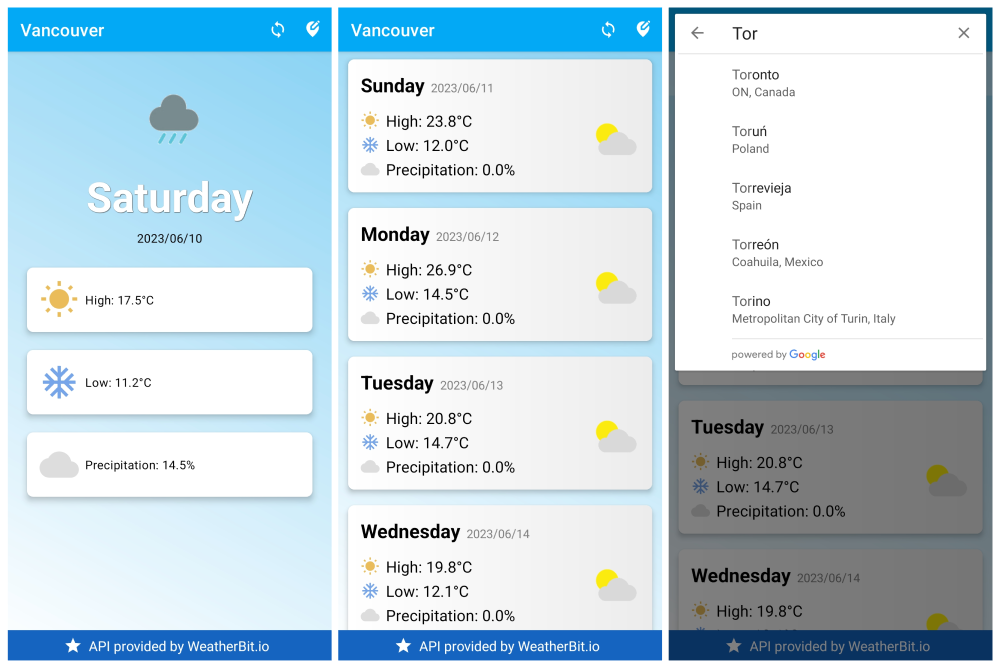

# WeatherApp

This demo application offers basic weather forecasts for various locations. By enabling users to search for a city, they can receive accurate and up-to-date weather information. This project serves as a foundation for integrating weather forecasts and Google APIs, providing a simple baseline for developers to build upon. 

## Screenshots



## Getting Started

To get started with this project, you'll need to get API keys from WeatherBit.io and Google Places. Follow these steps:

1. Go to [WeatherBit.io](https://www.weatherbit.io/account/create) and create an account (if you don't already have one). Once you've logged in, navigate to the API keys section and generate a new API key.

2. Next, go to the [Google Cloud Platform Console](https://console.cloud.google.com/). Create a new project (if you don't have one already), enable the Places API for your project in the library section, and then create credentials for your project to get the API key.

After you've obtained both API keys, you will need to add them to your `gradle.properties` file. If it doesn't exist, create one in the root directory of your project and insert the keys in the following way:

```properties
API_KEY_WEATHER = "your-weatherbit-api-key"
API_KEY_PLACES = "your-google-places-api-key"
```

Then, you can access these keys in the `Constants` class using the `BuildConfig` class which is automatically generated by Gradle:

```java
public class Constants {
    public static final String API_KEY_WEATHER = BuildConfig.API_KEY_WEATHER;
    public static final String API_KEY_PLACES = BuildConfig.API_KEY_PLACES;
    // ...
}
```

## Third-Party Licenses

This project uses the following third-party dependencies and APIs:

- **com.jakewharton.threetenabp** (https://github.com/JakeWharton/ThreeTenABP)
  - License URL: [Apache License, Version 2.0](http://www.apache.org/licenses/LICENSE-2.0)

- **Google Places API** (https://developers.google.com/maps/documentation/places/web-service)
  - Please see Google's [Terms of Service](https://developers.google.com/terms) for more details.

- **WeatherBit API** (https://www.weatherbit.io/api/meta)
  - Please see WeatherBit's [Terms of Service](https://www.weatherbit.io/terms) for more details.


