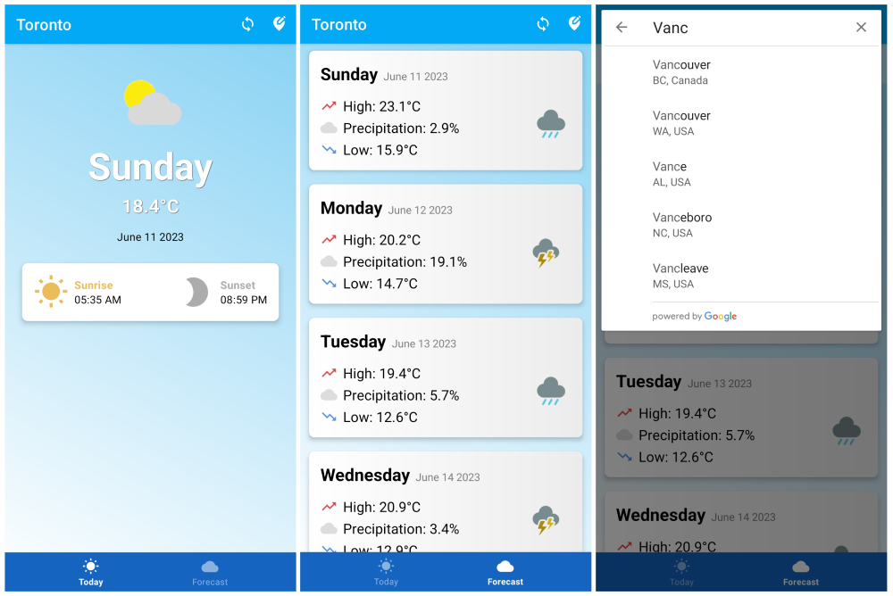

# 🌤️ WeatherApp

This Android application, built with Java and Android Studio, offers detailed weather forecasts for various locations worldwide. The app provides weather information for the current day and several days ahead, displaying data such as:

- Current temperature
- Sunrise and sunset times
- Lowest and highest temperatures
- Precipitation

By enabling users to search for a city, they can receive accurate and up-to-date weather information. This project serves as a foundation for integrating weather forecasts and Google APIs, providing a baseline for developers to build upon.

## 🛠️ Prerequisites

Before you begin, ensure you have met the following requirements:

- You have installed the latest version of Android Studio.
- You have installed the appropriate version of the Java Development Kit (JDK).
- You have registered on WeatherBit.io and Google Places to obtain API keys.


## 📸 Screenshots




## 🚀 Getting Started

To get started with this project, you'll need to get API keys from WeatherBit.io and Google Places. Follow these steps:

1. Go to [WeatherBit.io](https://www.weatherbit.io/account/create) and create an account (if you don't already have one). Once logged in, navigate to the API keys section and generate a new API key.

2. Next, go to the [Google Cloud Platform Console](https://console.cloud.google.com/). Create a new project (if you don't have one already), enable the Places API in the library section, and then create credentials for your project to get the API key.

After you've obtained both API keys, you will need to add them to your `gradle.properties` file. If it doesn't exist, create one in the root directory of your project and insert the keys in the following way:

```properties
API_KEY_WEATHER = "your-weatherbit-api-key"
API_KEY_PLACES = "your-google-places-api-key"
```

Then, you can access these keys in the `Constants` class using the `BuildConfig` class, which Gradle automatically generates:

```java
public class Constants {
    public static final String API_KEY_WEATHER = BuildConfig.API_KEY_WEATHER;
    public static final String API_KEY_PLACES = BuildConfig.API_KEY_PLACES;
    // ...
}
```

## 🧩 Installation & Usage

1. Clone the repository.
2. Open the project in Android Studio.
3. Run the project on the emulator or an actual device.

You'll be asked to grant location permissions upon launching the application for the first time. The app uses these permissions to display your location's current weather and forecast. Additionally, you can search for other cities. Enter the city name in the search bar to get the current weather and forecast for the next few days in that city.


## 💼 Contributing to WeatherApp

If you want to contribute to the project, follow these steps:

1. Fork the repository.
2. Create a new branch.
3. Make changes and test them in Android Studio.
4. Submit a pull request.

For significant changes, please open an issue first to discuss what you would like to change.


## ⚖️ License & Third-Party Licenses

```
MIT License

Copyright (c) 2023 Raad Shariat

Permission is hereby granted, free of charge, to any person obtaining a copy
of this software and associated documentation files (the "Software"), to deal
in the Software without restriction, including without limitation the rights
to use, copy, modify, merge, publish, distribute, sublicense, and/or sell
copies of the Software, and to permit persons to whom the Software is
furnished to do so, subject to the following conditions:

The above copyright notice and this permission notice shall be included in all
copies or substantial portions of the Software.

THE SOFTWARE IS PROVIDED "AS IS", WITHOUT WARRANTY OF ANY KIND, EXPRESS OR
IMPLIED, INCLUDING BUT NOT LIMITED TO THE WARRANTIES OF MERCHANTABILITY,
FITNESS FOR A PARTICULAR PURPOSE AND NONINFRINGEMENT. IN NO EVENT SHALL THE
AUTHORS OR COPYRIGHT HOLDERS BE LIABLE FOR ANY CLAIM, DAMAGES OR OTHER
LIABILITY, WHETHER IN AN ACTION OF CONTRACT, TORT OR OTHERWISE, ARISING FROM,
OUT OF OR IN CONNECTION WITH THE SOFTWARE OR THE USE OR OTHER DEALINGS IN THE
SOFTWARE.
```

This project also uses the following third-party dependencies and APIs:

| Dependency/API | URL | License |
| -------------- | --- | ------- |
| com.jakewharton.threetenabp | [ThreeTenABP](https://github.com/JakeWharton/ThreeTenABP) | [Apache License, Version 2.0](http://www.apache.org/licenses/LICENSE-2.0) |
| Google Places API | [Google Places](https://developers.google.com/maps/documentation/places/web-service) | [Google's Terms of Service](https://developers.google.com/terms) |
| WeatherBit API | [WeatherBit](https://www.weatherbit.io/api/meta) | [WeatherBit's Terms of Service](https://www.weatherbit.io/terms) |
